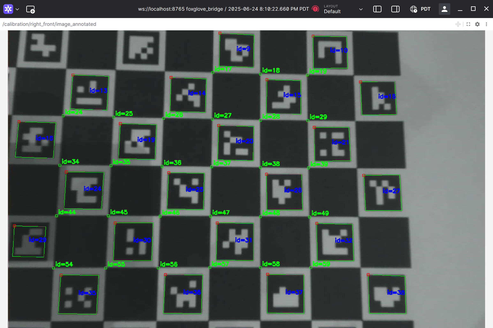

# Camera Calibration Guide for ros_vision

This guide provides instructions for calibrating cameras with the ros_vision pipeline.

## Run The Intrinsic Camera Calibration Pipeline

The system has the ability to perform intrinsic camera calibration.  Two types of camera calibration are supported: charuco calibration and checkerboard calibration.

### Important Note On Calibration Boards

To run the intrinsic camera calibration you need a calibration board with either a charuco or chessboard pattern on it.  You can find these patterns online, or you can even [generate them using OpenCV](https://docs.opencv.org/4.x/df/d4a/tutorial_charuco_detection.html).  It's super tempting to print one of these patterns on an 8.5x11 piece of paper and then start calibrating your camera.

Unfortunately this is the biggest mistake you can make!

You need to print this pattern as large as possible, and 8.5x11 is not large enough.  We use a board that is 48" wide by 36" long for calibration.  The cal target needs to be large and cover the entire frame of the camera during calibration.  Holding a small target close to the camera to acheive this effect can produce bad results and wildly wrong calibrations.  There is a nice write up on the [mrcal page](https://mrcal.secretsauce.net/docs-2.2/tour-choreography.html) that addresses many aspects of camera calibration and how to do it to produce the best results.

To print one of these you can use the calib.io generators and print it on a foam board from FedEx, or you can order a very professionally made one from [calib.io](https://calib.io/products/charuco-targets).

If you only take one piece of advice in your life, take this one.  Print or but a large calibration target before starting calibration!  


### Start The Charuco Calibration Pipeline Using The Launcher

The calibration needs a charuco board printed as DICT_4x4, e.g. like one generated from here: [Charuco Pattern Generator](https://calib.io/pages/camera-calibration-pattern-generator)

- plug in a USB camera.  Arducam works best (at least we've tested it!)
- in a terminal type:

```
source install/setup.bash
ros2 launch ros_vision_launch charuco_calibrate.launch.py serial:=766 max_frames:=30 board_rows:=8 board_cols:=11 square_length:=0.015 marker_length:=0.011
```

The arguments are:
- serial : the serial number of the camera you want to calibrate
- max_frames: the number of frames to collect marker points on before calibrating
- board_rows: the number of rows the charuco board has
- board_cols: the number of columns the charuco board has
- square_length: the physical length of the squares on the charuco board, in units of meters.  Always measure this!
- marker_length: the physical length of the markers on the charuco board, in units of meters.  Always measure this!

You don't have to specify all the arguments, but you must specify the serial argument.

If everything is working properly what will happen is the usb_camera node will be started and will collect frames at a lower frame rate (currently 4 frames per second, specified in src/ros_vision_launch/launch/calibrate_camera.launch.py).  The camera_calibrator node will be started and subscribe to the raw image topic for the camera.  When a new image is detected the charuco board will attempt to be detected.  The detected markers will be drawn on the image and the image will be published to a /calibration topic.  You can view these topics in foxglove.

After max_frames of detected markers are collected, the OpenCV calibration utility will be run and the calibration parameters will be saved to a file.  You will need to install the file into the source tree properly (typically src/vision_config_data/data/calibration) and rerun the build for the new calibration file to take effect.



### Start The Checkerboard Calibration Pipeline Using The Launcher

The calibration needs a chessboard board like one generated from here: [Chessboard Pattern Generator](https://calib.io/pages/camera-calibration-pattern-generator).

This utility requires you to set the dimensions of the chessboard, but wants the number of *interior corners* not the number of squares. To take an example, an 8 row by 11 column chess board will have 7 interior corners for the row and 10 interior corners for the columns.  So that is what you would specify below for board_rows and board_cols: `board_rows:=7 board_cols:=10`.  

- plug in a USB camera.  Arducam works best (at least we've tested it!)
- in a terminal type:

```
source install/setup.bash
ros2 launch ros_vision_launch checkerboard_calibrate.launch.py serial:=766 max_frames:=30 board_rows:=7 board_cols:=10 square_length:=0.015
```

The arguments are:
- serial : the serial number of the camera you want to calibrate
- max_frames: the number of frames to collect marker points on before calibrating
- board_rows: the number of interior corners of the rows the chessboard board has
- board_cols: the number of interior corners of the columns the charuco board has
- square_length: the physical length of the squares on the charuco board, in units of meters.  Always measure this!

You don't have to specify all the arguments, but you must specify the serial argument.

If everything is working properly what will happen is the usb_camera node will be started and will collect frames at a lower frame rate (currently 4 frames per second, specified in src/ros_vision_launch/launch/calibrate_camera.launch.py).  The camera_calibrator node will be started and subscribe to the raw image topic for the camera.  When a new image is detected the charuco board will attempt to be detected.  The detected markers will be drawn on the image and the image will be published to a /calibration topic.  You can view these topics in foxglove.

After max_frames of detected markers are collected, the OpenCV calibration utility will be run and the calibration parameters will be saved to a file.  You will need to install the file into the source tree properly (typically src/vision_config_data/data/calibration) and rerun the build for the new calibration file to take effect.