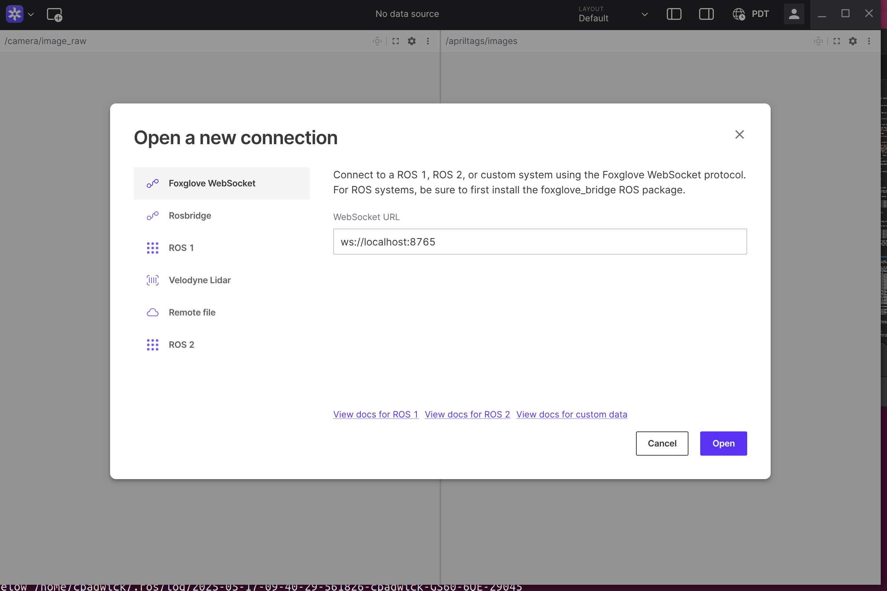
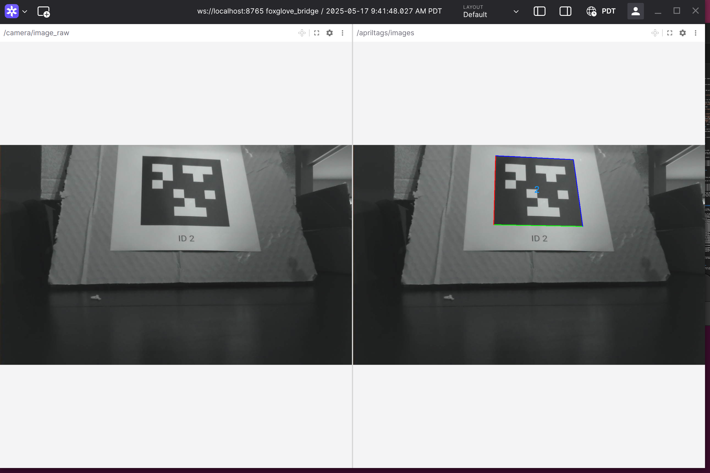

# ros_vision
A ROS2 based vision system for robotics


# Overview

This repo contains a ROS2 based version of the vision system for Team766.  As of now this is a prototype for evaluation.

## Requirements

- OS: ubuntu 22.04
- a functioning Nvidia GPU - AMD not supported

## Install ROS

To install ROS2 follow these [instructions](https://docs.ros.org/en/humble/Installation/Ubuntu-Install-Debs.html)

## Install Foxglove

Foxglove studio is a powerful tool that lets you inspect ros image messages, topics, and outputs.  I recommend installing it.

- Download Foxglove Studio from this [link](https://foxglove.dev/download)
- install with `sudo apt install ./foxglove-studio-latest-linux-amd64.deb`
- `sudo apt update && sudo apt install foxglove-studio`

Install the ros2 Foxglove bridge:

- `sudo apt install ros-humble-foxglove-bridge`

## Build The Code

- Clone the repo: `git clone git@github.com:Team766/ros_vision.git`
- `cd ros_vision`
- `source /opt/ros/humble/setup.bash`
- Run the install deps script: `sudo ./install_deps.sh`
- inspect your nvidia gpu compute capability with the following command `nvidia-smi --query-gpu compute_cap --format=csv`  
- edit the file `./build_env_vars.sh`, ensure the line that says `export CMAKE_CUDA_ARCHITECTURES 52` matches the compute capability of your machine.  Note that nvidia-smi reports the capability as `X.Y` but you need to put in `XY` in the file.  Save the file.
- source the file `source ./build_env_vars.sh`.  Now your environment is ready and you can build the code.
- Now you are ready to build.  Note that the build will take quite a while as it pulls down dependencies like OpenCV and WpiLIB.

### Orin Building Instructions

The Orin is a bit wimpy so we need to make sure it only uses 2 processors during the build, otherwise it will fail.
```
colcon build --cmake-args -DNUM_PROCESSORS=2--event-handlers console_direct+
```

### x86_64 Build Instructions
```
colcon build --event-handlers console_direct+
```

## Run The Pipeline

### Start The System Using The Launcher

- plug in a USB camera.  Arducam works best (at least we've tested it!)
- in a terminal type:

```
source install/setup.bash
ros2 launch ros_vision launch_vision.py
```

This will launches the following nodes:
- the camera will attempt to be autodetected.  This will succeed if the string Camera is found in the camera entry in the /dev/v4l/by-id directory.  
- usb_camera_node which collects frames from the camera and publishes them to a topic
- apriltags_cuda node which takes frames from the topic above and runs the apriltag detection alg on the GPU.  It prints out detection data to the screen and also publishes detection images to a second topic.
- a foxglove bridge node, which makes it easy to view the messages in FoxGlove.

If everything is working properly you should see some text scrolling by on the screen corresponding to apriltag detections.

### Startup Foxglove Studio

On the host machine startup Foxglove Studio (Activities -> Foxglove).  If it is your first time installing it you need to sign up for an account.  It's free so go ahead and do that.  If this bothers you then you don't have to use foxglove, you could use the Seasocks viewer (see below).

Once foxglove is running, click Open Connection and select the local webserver as shown below.



Once the connection is opened you should see the two images displayed, one from the usb camera and one from the aprtiltag detection.




## Instructions To Start The Nodes Manually

### Start The USB Camera Node

- plug in a USB camera
- in one terminal run:
```
source install/setup.bash
ros2 run usb_camera usb_camera_node --ros-args -p camera_idx:=0 -p topic_name:=camera/image_raw
```
This will start the camera process which initializes the camera in index 0, reads frames from it, and publishes them to a topic called `camera/image_raw`.  If there is an error it probably means your camera is not on `/dev/video0`.  Try another index and rebuild.

If everything is working you should see something like this:

```
[INFO] [1746927683.481375637] [camera_publisher]: Opening camera on idx: '0'
[INFO] [1746927683.781965633] [camera_publisher]: Width: '1280'
[INFO] [1746927683.782025468] [camera_publisher]: Height: '800'
[INFO] [1746927683.782056474] [camera_publisher]: FPS: '100'
[INFO] [1746927683.782076952] [camera_publisher]: Pubishing on Topic: 'camera/image_raw'

```

### Start The Apriltag Pipeline

- in another terminal run:

```
source install/setup.bash
ros2 run apriltags_cuda apriltags_cuda_node 
```

Find a 36H11 type apriltag and put it in front of the camera.  If everything is working you should see the following:

```
[INFO] [1747188386.237090632] [apriltags_detector]: GPU Apriltag Detector created, took 66 ms
[INFO] [1747188386.249408019] [apriltags_detector]: Tag id: 2, x: 0.037569, y: -0.174967, z: 0.590192, err: 0.000000
[INFO] [1747188386.254917685] [apriltags_detector]: Total Time: 14 ms, Det Time: 3 ms
[INFO] [1747188386.265243683] [apriltags_detector]: Tag id: 2, x: 0.037595, y: -0.174905, z: 0.590014, err: 0.000000
[INFO] [1747188386.269137448] [apriltags_detector]: Total Time: 10 ms, Det Time: 3 ms
[INFO] [1747188386.279630664] [apriltags_detector]: Tag id: 2, x: 0.037568, y: -0.174903, z: 0.589915, err: 0.000000
```
and a bunch of tag detections will get printed out to the screen.  What is happening is that the apriltags_cuda_node is listening to the topic /camera/image_raw.  When a new image is published to that topic, the node receives the image and processes the image with the apriltag algorithm.  If any tags are detected they are printed out to the screen.  The node also publishes an image (with or without any detections) to a topic called `/apriltags/images.

## Start The Foxglove Bridge

- in another terminal run:

```
source install/setup.bash
ros2 launch foxglove_bridge foxglove_bridge_launch.xml
```

This will start the foxglove bridge, which is a websockets server which relays messages between ros and foxglove.  If everything is working you should see something like this:

```
[INFO] [launch]: All log files can be found below /home/cpadwick/.ros/log/2025-05-17-09-34-17-563194-cpadwick-GS60-6QE-28777
[INFO] [launch]: Default logging verbosity is set to INFO
[INFO] [foxglove_bridge-1]: process started with pid [28779]
[foxglove_bridge-1] [INFO] [1747499658.195251008] [foxglove_bridge_component_manager]: Load Library: /opt/ros/humble/lib/libfoxglove_bridge_component.so
[foxglove_bridge-1] [INFO] [1747499658.216260153] [foxglove_bridge_component_manager]: Found class: rclcpp_components::NodeFactoryTemplate<foxglove_bridge::FoxgloveBridge>
[foxglove_bridge-1] [INFO] [1747499658.216344334] [foxglove_bridge_component_manager]: Instantiate class: rclcpp_components::NodeFactoryTemplate<foxglove_bridge::FoxgloveBridge>
[foxglove_bridge-1] [INFO] [1747499658.231588613] [foxglove_bridge]: Starting foxglove_bridge (humble, 0.8.3@) with WebSocket++/0.8.2
[foxglove_bridge-1] [INFO] [1747499658.233352674] [foxglove_bridge]: [WS] Server running without TLS
[foxglove_bridge-1] [INFO] [1747499658.233975660] [foxglove_bridge]: [WS] WebSocket server listening at ws://0.0.0.0:8765
[foxglove_bridge-1] [INFO] [1747499658.234006347] [foxglove_bridge]: [WS] WebSocket server run loop started
[foxglove_bridge-1] [INFO] [1747499658.515560727] [foxglove_bridge]: [WS] Client 127.0.0.1:60254 connected via /
[foxglove_bridge-1] [INFO] [1747499658.592951066] [foxglove_bridge]: [WS] Subscribing to connection graph updates.
[foxglove_bridge-1] [INFO] [1747499658.596115481] [foxglove_bridge]: Subscribing to topic "/camera/image_raw" (sensor_msgs/msg/Image) on channel 2 with reliablity "reliable"
[foxglove_bridge-1] [INFO] [1747499658.600123052] [foxglove_bridge]: Subscribing to topic "/apriltags/images" (sensor_msgs/msg/Image) on channel 4 with reliablity "reliable"
[foxglove_bridge-1] [INFO] [1747499658.695932288] [foxglove_bridge]: Client 127.0.0.1:60254 is advertising "/move_base_simple/goal" (geometry_msgs/PoseStamped) on channel 1 with encoding "cdr"
[foxglove_bridge-1] [INFO] [1747499658.698956966] [foxglove_bridge]: Client 127.0.0.1:60254 is advertising "/clicked_point" (geometry_msgs/PointStamped) on channel 2 with encoding "cdr"
[foxglove_bridge-1] [INFO] [1747499658.701291555] [foxglove_bridge]: Client 127.0.0.1:60254 is advertising "/initialpose" (geometry_msgs/PoseWithCovarianceStamped) on channel 3 with encoding "cdr"
[foxglove_bridge-1] [INFO] [1747499659.816270162] [foxglove_bridge]: Unsubscribing from topic "/camera/image_raw" (sensor_msgs/msg/Image) on channel 2
[foxglove_bridge-1] [INFO] [1747499659.816602346] [foxglove_bridge]: Unsubscribing from topic "/apriltags/images" (sensor_msgs/msg/Image) on channel 4
[foxglove_bridge-1] [INFO] [1747499659.816743529] [foxglove_bridge]: Subscribing to topic "/camera/image_raw" (sensor_msgs/msg/Image) on channel 2 with reliablity "reliable"
[foxglove_bridge-1] [INFO] [1747499660.169701805] [foxglove_bridge]: Subscribing to topic "/apriltags/images" (sensor_msgs/msg/Image) on channel 4 with reliablity "reliable"
```

## Startup Foxglove Studio

On the host machine startup Foxglove Studio (Activities -> Foxglove).  If it is your first time installing it you need to sign up for an account.  It's free so go ahead and do that.  If this bothers you then you don't have to use foxglove, you could use the Seasocks viewer (see below).

Once foxglove is running, click Open Connection and select the local webserver as shown below.


Once the connection is opened you should see the two images displayed, one from the usb camera and one from the aprtiltag detection.


# Seasocks Viewer Instructions - waaaaayy less cool than Foxglove

If you don't want to use foxglove for whatever reason you can use the seasocks viewer to view the images from the topics.  I wouldn't recommend trying to run foxglove and the seasocks viewer at the same time.

## Start the Image Viewer

- in another terminal run:

```
source install/setup.bash
ros2 run seasocks_viewer seasocks_viewer_node --ros-args -p port:=9090 -p topic_name:=camera/image_raw
```

If everything is working properly you should see the following output

```
info: Serving content from /home/cpadwick/code/ros_vision/install/ros_vision/share/seasocks_viewer/web
info: Listening on http://cpadwick-GS60-6QE:9090/
[INFO] [1746928224.850683239] [seasocks_viewer_node]: Seasocks viewer running at ws://localhost:'9090'/image
[INFO] [1746928224.850807410] [seasocks_viewer_node]: Reading images from topic: 'camera/image_raw'
```

What is happening is that the seasocks viewer node is reading messages off of the `camera/image_raw` topic, and is showing it on the web page at http://localhost:9090 . Navigate to the web page and verify that you can see the camera images.

## Fire Up Another Viewer To View The Apriltag Detections

- in another terminal run:

```
source install/setup.bash
ros2 run seasocks_viewer seasocks_viewer_node --ros-args -p port:=9099 -p topic_name:=apriltags/images
```

If everything is working properly you should see the following output

```
info: Serving content from /home/cpadwick/code/ros_vision/install/ros_vision/share/seasocks_viewer/web
info: Listening on http://cpadwick-GS60-6QE:9099/
[INFO] [1746928224.850683239] [seasocks_viewer_node]: Seasocks viewer running at ws://localhost:'9099'/image
[INFO] [1746928224.850807410] [seasocks_viewer_node]: Reading images from topic: 'apriltags/images'
```

What is happening is that the seasocks viewer node is reading messages off of the `apriltags/images` topic, and is showing it on the web page at http://localhost:9099 . Navigate to the web page and verify that you can see the camera images with an apriltag detection shown on the image.
